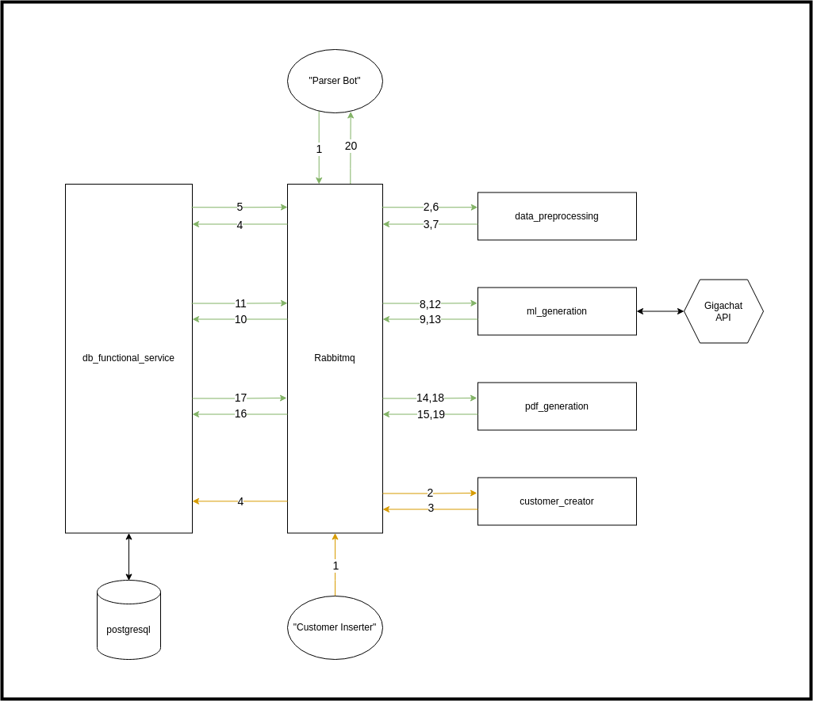

# System For Creating Corporate Offers (CO)

This project is a system that consists of several microservices. It is intended for companies and legal entities (further referred to as `customer`) and allows you to automate the process of generating a corporate offer for new `clients`.

## Features

- **CO generation in `pdf` format** &mdash; system automatically generates corporate offers in `pdf` format based on the data provided:
  * text of a potential `client` message
  * message date
  * `client` name
  * `customer` name
- **Saving to the database** &mdash; after generating CO, system saves path to generated file into the database.

## Accessible microservices

* `data_preprocessing`
  * Receives `csv` file with `clietns` messages from telegram parser bot.
  * Saves `csv` file with new messages (can be used in the future to train ML model).
  * Filters messages with advertisements and third-party information, leaving only those that really need the `customer` services.
  * Send appropriate messages to `ml_generation` service.

* `ml_generation`
  * Generates text of a CO based on `client` messages.
  * Sends generated text to the `pdf_generation` service.

* `pdf_generation`
  * Inserts the text of the corporate offer into a template `pdf` document.
  * Sends the generated `pdf` to a third-party service.

* `db_funstional_service`
  * Stores data about customers, clients, CO and messages.
  * Other services use that one as a database.

* `customer_creator`
  * Inserts customer data into the database via `db_functional_service`.
  * Generates additional information about `customer` that is used by ML model to improve the quality of generated offers.

## Getting started

Services implementation and startup instructions are located in `scco` folder.

## TODO
- **Error handling** &mdash; if the system receives an error during the generation of the CO, it must record the status in the database that CO has not been generated and indicate the error in the comment field why it has not been generated.
- **Manual generation** &mdash; in addition to automatically generating CO for all `clients`, make a setting that you can select a specific `client` from the list and make CO only for him.
