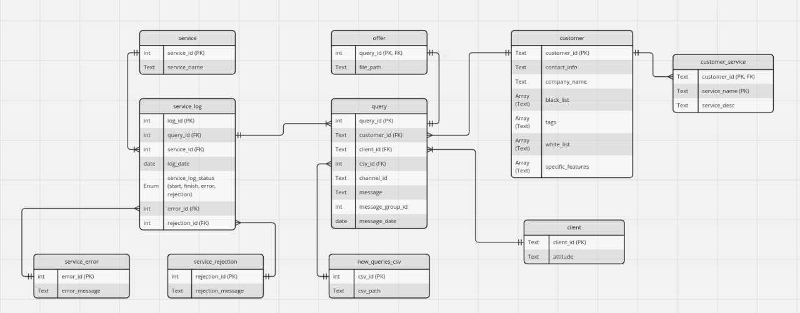

# db_functional_service

This service is responsible for managing database.


## Functionality
* Stores data about customers, clients, CO and messages.
* Other services use that one as a database.


## Files With Secrets
See `Prerequisites` section in [README.md](../README.md) for all services.


## API
Examples of received (request) and sent (answer) data is located in `db_functional_service/src/service/data`.


## Implementation Details
* `PostrgeSQL` is used as a database.
* `sqlalchemy` orm is used for interaction with database.
* Database schema:
* [Entity Relationship Diagram](https://miro.com/app/board/uXjVKZsS6Io=/)


## Installation and run
```bash
./run.sh --file src/main.py
```

## CI
From `db_functional_service` folder run:
```bash
docker build -t scco_test_db_functional_service .
docker run --name scco_test_db_functional_service scco_test_db_functional_service pytest
```

## Pgadmin
* Go to `localhost:5050`
* Choose `Servers` -> `Register` -> `Server`.
* Enter a custom server name.
* Set `host` to **container name**:
  * `scco_crud_test_postgres_container`, in case run locally from `tests`
  * `scco_debug_postgres_fs_container`, in case all services are run.
* Other fields must satisfy `.env.secret.postgres` (its setup is in common service's README.md)

Some queries are located in [docs/sql_queries.md](docs/sql_queries.md).


## Development
Run `postgresql` + `pgadmin` locally (from `tests` folder).
```bash
docker-compose up --build -d
docker-compose down --remove-orphans --volumes
```

Run service locally (from `db_functional_service` folder).
```bash
./run.sh --reinstall --editable --host --file tests/main_test.py
./run.sh -r -e -h -f tests/main_test.py # short version
./run.sh -h -f tests/main_test.py # without reinstall
```

Debug
```bash
# Build image.
docker build -t scco_debug_db_functional_service .
# Default run.
docker run --name scco_debug_db_functional_service scco_debug_db_functional_service
# Interactive (manual execution).
docker run -it --name scco_debug_db_functional_service --entrypoint="/bin/bash" scco_debug_db_functional_service

docker rm scco_debug_db_functional_service
docker rmi scco_debug_db_functional_service
```


## Handy
* Postgres url:
  ```text
  postgresql://[user[:password]@][netloc][:port][/dbname][?param1=value1&...]
  ```
* Multiple databases vs multiple schemas: https://stackoverflow.com/questions/28951786/postgresql-multiple-database-vs-multiple-schemas
* Mocking: https://pytest-with-eric.com/mocking/pytest-mocking/
* `sqlalchemy.engine.row.Row` emulates `namedtuple` API: https://stackoverflow.com/questions/68967890/how-to-manually-create-a-sqlalchemy-query-object
